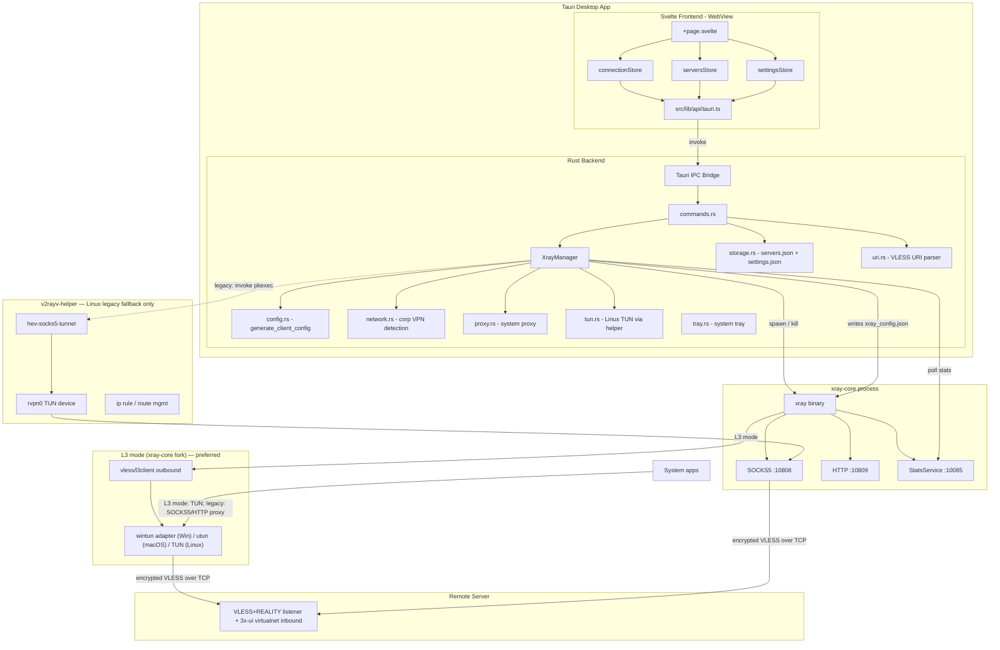
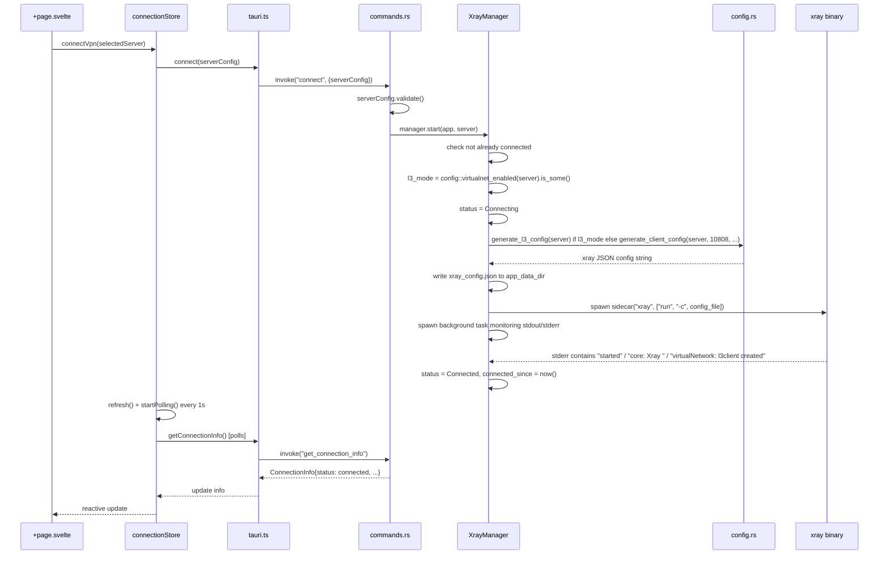
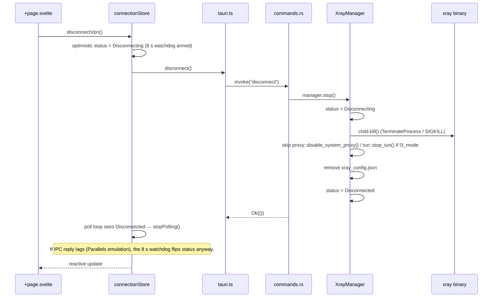

# v2rayV — Architecture

## System Overview

v2rayV is a cross-platform VPN client that manages a fork of xray-core as a child process (sidecar). The Svelte frontend communicates with the Rust backend exclusively through Tauri's IPC bridge. The backend picks one of three operating modes per server, gated entirely by the share-link the user imported:

- **L3 (virtualnet) mode** (preferred). The share-link contains `vnet=1&vnetIp=...`. The generated xray config has no SOCKS5/HTTP inbound — only a VLESS+REALITY outbound with a `virtualNetwork{}` block. Our forked xray-core opens a TUN device itself (wintun on Windows, utun on macOS, native TUN on Linux) via the new `vless/l3client` outbound. v2rayV does **not** touch the system proxy or run `hev-socks5-tunnel`.
- **Proxy mode** (legacy fallback; all desktop OSes). xray exposes local SOCKS5 + HTTP listeners and `proxy.rs` enables a system-wide proxy via `gsettings` (Linux), the registry (Windows), or `networksetup` (macOS).
- **Linux TUN mode** (legacy fallback, Linux only). A dedicated `v2rayv-helper` (invoked via `pkexec`) creates a TUN interface and runs hev-socks5-tunnel to convert TUN packets into SOCKS5 traffic. Used only when the share-link has no `vnet*` params and the user explicitly opts into TUN.

Mode selection is automatic: `XrayManager::start()` checks `config::virtualnet_enabled(server)`. If it returns `Some(_)`, L3 mode wins and the proxy/TUN code paths are bypassed entirely.




| File | Responsibility |
|------|---------------|
| `main.rs` | Entry point; calls `v2rayv_lib::run()` |
| `lib.rs` | Tauri builder setup: registers plugins, manages `XrayManager` state, hooks startup recovery (stale TUN cleanup, system-proxy reset, auto-connect), registers all IPC commands |
| `models.rs` | Core data types: `ServerConfig` (with `virtualnet` + `subscription_id` fields), `Subscription`, `VirtualNetSettings`, `RealitySettings`, `ConnectionInfo`, `ConnectionStatus`, `SpeedStats`, `LogEntry`, `AppSettings`, `DetectedVpn`, `AppError` |
| `commands.rs` | All `#[tauri::command]` handlers — connection, server CRUD, **subscription CRUD** (`list_subscriptions`, `add_subscription`, `refresh_subscription`, `delete_subscription`), import/export, settings, logs, speed stats, bypass-domain reload, VPN detection. Async commands wrap storage I/O in `tauri::async_runtime::spawn_blocking`. |
| `xray.rs` | `XrayManager` struct — spawns/kills xray sidecar (hard-kill via `child.kill()` = `TerminateProcess`/`SIGKILL`), polls StatsService, buffers logs, gates proxy/TUN startup on `l3_mode` flag, emits `connection-status-changed` events |
| `config.rs` | `generate_client_config()` and `generate_l3_config()` build the xray JSON config (legacy proxy/TUN or L3 virtualnet flavour); `virtualnet_enabled(server)` detects which flavour to use |
| `subscription.rs` | HTTPS fetch + base64 decode + per-line `vless://` parsing for subscription URLs |
| `manifest.xml` _(Windows)_ | UAC manifest declaring `requireAdministrator` (needed by `WintunCreateAdapter`); embedded into the .exe by `build.rs` via `tauri_build::WindowsAttributes::app_manifest` |
| `network.rs` | `detect_vpn_routes()` — detects corporate VPN interfaces/subnets via `ip -j route show`; `collect_bypass_subnets()` flattens results; `detect_default_gateway_and_ip()` for TUN setup; corporate-VPN DNS scrape from `/etc/resolv.conf` |
| `proxy.rs` _(desktop)_ | `enable_system_proxy()` / `disable_system_proxy()` / `reset_stale_system_proxy()` — Linux (`gsettings`), Windows (registry), macOS (`networksetup`) |
| `tun.rs` _(Linux)_ | `start_tun()` / `stop_tun()` / `cleanup_stale_tun()` — talks to `v2rayv-helper` via `pkexec` to create the `rvpn0` TUN device, run `hev-socks5-tunnel`, and add `ip rule` / `ip route` entries |
| `tray.rs` _(desktop)_ | System tray menu (Show / Connect / Quit), updates the toggle label by listening for `connection-status-changed` |
| `storage.rs` | Reads/writes `servers.json` and `settings.json` in the OS app config directory |
| `uri.rs` | `parse_vless_uri()` and `to_vless_uri()` — VLESS URI serialization; also exposes `parse_vless_uri_cmd` and `export_vless_uri` as Tauri commands |

### Svelte Frontend (`src/`)

| Path | Responsibility |
|------|---------------|
| `src/routes/+layout.ts` | Sets `prerender = true`, `ssr = false` (static SPA) |
| `src/routes/+layout.svelte` | Root layout; injects CSS and favicon |
| `src/routes/+page.svelte` | Main page; orchestrates all stores and components |
| `src/routes/logs/+page.svelte` | Live log viewer route (paired with `LogViewer` component) |
| `src/lib/api/tauri.ts` | Thin wrappers around `invoke()` for every Tauri command |
| `src/lib/types/index.ts` | TypeScript interfaces mirroring Rust structs |
| `src/lib/stores/connection.svelte.ts` | Svelte 5 rune store for connection state, polling, speed-stat updates |
| `src/lib/stores/servers.svelte.ts` | Svelte 5 rune store for server list and selection |
| `src/lib/stores/settings.svelte.ts` | Svelte 5 rune store for `AppSettings` (auto-connect, bypass domains) with rollback on save failure |
| `src/lib/components/ConnectButton.svelte` | Circular toggle button; reflects connection status via color |
| `src/lib/components/StatusDisplay.svelte` | Status indicator dot, connection timer (no longer renders the duplicate "Connected" label or speed tiles) |
| `src/lib/components/ServerList.svelte` | Scrollable list of **manually-added** servers with selection, edit, delete (subscription servers live in `SubscriptionList` instead) |
| `src/lib/components/ServerForm.svelte` | Modal form for adding/editing a server manually |
| `src/lib/components/SubscriptionList.svelte` | One header per saved subscription (sorted oldest-first) with Refresh / Delete buttons; nested read-only servers below each header. Includes a 25 s frontend watchdog that force-reloads stores if `refresh_subscription` IPC stalls. |
| `src/lib/components/SubscriptionModal.svelte` | Modal form for adding a subscription (name + URL); WebView2 autofill suppressed via non-standard `name` attributes + `autocomplete="off"` |
| `src/lib/components/ImportExportBar.svelte` | Toolbar with Import / Export dropdowns (file + URI + Subscription URL) — lives in the top-right header next to ThemeToggle |
| `src/lib/components/UriInputModal.svelte` | Modal text area for pasting a vless:// URI |
| `src/lib/components/LogViewer.svelte` | Tail of xray logs from the in-memory buffer; Copy-to-clipboard button (filter-aware) |
| `src/lib/components/ThemeToggle.svelte` | Light/dark toggle |
| `src/lib/components/ui/` | shadcn-svelte primitives (button, dialog, input, ...) |
| `src/lib/utils/index.ts` | `cn()` helper — `clsx` + `tailwind-merge` |

## Data Flow: Connect/Disconnect Cycle

### Connect



### Disconnect



## IPC Contract

All commands are registered in `src-tauri/src/lib.rs` via `tauri::generate_handler!`. The frontend calls them through `src/lib/api/tauri.ts`.

### Subscription Commands

| Command name | Rust handler | Parameters | Return type |
|---|---|---|---|
| `list_subscriptions` | `commands::list_subscriptions` | _(none)_ | `Result<Vec<Subscription>, String>` |
| `add_subscription` | `commands::add_subscription` (async) | `name: String`, `url: String` | `Result<Subscription, String>` |
| `refresh_subscription` | `commands::refresh_subscription` (async) | `id: String` | `Result<(Subscription, Vec<ServerConfig>), String>` |
| `delete_subscription` | `commands::delete_subscription` | `id: String`, `delete_servers: bool` | `Result<(), String>` |

`refresh_subscription` re-fetches the URL, removes every `ServerConfig` whose `subscription_id` matches the given id, imports the freshly-parsed servers (tagged with that id), and updates `last_updated_at` + `last_server_count`. Manually-added servers (`subscription_id == None`) and servers from other subscriptions are not touched.

### Connection Commands

| Command name | Rust handler | Parameters | Return type |
|---|---|---|---|
| `connect` | `commands::connect` | `server_config: ServerConfig` | `Result<(), String>` |
| `disconnect` | `commands::disconnect` | _(none)_ | `Result<(), String>` |
| `get_status` | `commands::get_status` | _(none)_ | `Result<ConnectionStatus, String>` |
| `get_connection_info` | `commands::get_connection_info` | _(none)_ | `Result<ConnectionInfo, String>` |
| `test_connection` | `commands::test_connection` | _(none)_ | `Result<bool, String>` |
| `get_socks_port` | `commands::get_socks_port` | _(none)_ | `Result<u16, String>` |
| `validate_config` | `commands::validate_config` | `server_config: ServerConfig` | `Result<(), String>` |
| `detect_vpn_interfaces` | `commands::detect_vpn_interfaces` | _(none)_ | `Result<Vec<DetectedVpn>, String>` |
| `get_speed_stats` | `commands::get_speed_stats` | _(none)_ | `Result<SpeedStats, String>` |

### Server CRUD Commands

| Command name | Rust handler | Parameters | Return type |
|---|---|---|---|
| `get_servers` | `commands::get_servers` | _(none)_ | `Result<Vec<ServerConfig>, String>` |
| `add_server` | `commands::add_server` | `server_config: ServerConfig` | `Result<ServerConfig, String>` |
| `update_server` | `commands::update_server` | `server_config: ServerConfig` | `Result<(), String>` |
| `delete_server` | `commands::delete_server` | `id: String` | `Result<(), String>` |

### Import/Export Commands

| Command name | Rust handler | Parameters | Return type |
|---|---|---|---|
| `export_servers` | `commands::export_servers` | _(none)_ | `Result<String, String>` (pretty JSON) |
| `import_servers` | `commands::import_servers` | `json: String` | `Result<Vec<ServerConfig>, String>` |
| `parse_vless_uri_cmd` | `uri::parse_vless_uri_cmd` | `uri: String` | `Result<ServerConfig, String>` |
| `export_vless_uri` | `uri::export_vless_uri` | `server_config: ServerConfig` | `Result<String, String>` |

### Settings & Logs

| Command name | Rust handler | Parameters | Return type |
|---|---|---|---|
| `get_settings` | `commands::get_settings` | _(none)_ | `Result<AppSettings, String>` |
| `update_settings` | `commands::update_settings` | `settings: AppSettings` | `Result<(), String>` |
| `apply_bypass_domains` | `commands::apply_bypass_domains` | `domains: Vec<String>` | `Result<bool, String>` (true if a live session was reloaded) |
| `get_logs` | `commands::get_logs` | _(none)_ | `Result<Vec<LogEntry>, String>` |
| `clear_logs` | `commands::clear_logs` | _(none)_ | `Result<(), String>` |

## State Management

### Rust: `XrayManager` (`src-tauri/src/xray.rs`)

`XrayManager` is a Tauri managed state singleton. All fields are `Arc<Mutex<...>>` so they can be read from any IPC handler. Several fields are gated to a single platform — the table notes which.

| Field | Platform | Purpose |
|-------|----------|---------|
| `child` | desktop | Handle to the running xray sidecar (`CommandChild`) |
| `state` | all | Current `ConnectionInfo` (status, server name/address, connected_since, error) |
| `config_path` | desktop | Path to the temp xray config for cleanup |
| `l3_mode` | desktop | `AtomicBool` set in `start()`, cleared in `stop_desktop()`. Gates whether the SOCKS5 verify thread, system-proxy enable/disable, and `hev-socks5-tunnel` startup actually run. |
| `stats` | all | Last `SpeedStats` snapshot computed from xray's StatsService |
| `prev_uplink` / `prev_downlink` | all | Previous traffic counters used to derive instantaneous speed |
| `logs` | all | Bounded `VecDeque<LogEntry>` (cap `MAX_LOG_ENTRIES = 1000`) populated from xray stdout/stderr |
| `bypass_domains` | desktop | Last applied bypass-domain list (legacy mode only — used when `apply_bypass_domains` reloads) |
| `bypass_subnets` | desktop | Flattened bypass subnets from VPN detection (legacy mode only) |
| `detected_vpns` | all | Last detected corporate VPN interfaces and subnets |

State transitions:

```
Disconnected → Connecting → Connected
Connected    → Disconnecting → Disconnected
(xray crash) → Error
```

A background async task (spawned via `tauri::async_runtime::spawn`) monitors xray's stderr. It transitions state from `Connecting` to `Connected` when it sees any of `"started"`, `"core: Xray "`, or `"virtualNetwork: l3client created"` in the output (the multiple patterns paper over Windows pipe buffering reorders). A 6 s fallback timer flips the state too if any output at all has been observed but none of the specific patterns matched. A 15 s hard timeout still fires for genuinely stuck launches. On detection, the task emits a `connection-status-changed` event (the tray menu listens for this to flip the label) and starts polling the StatsService. If xray exits unexpectedly and state is not `Disconnecting`, it sets state to `Error` and tears down the system proxy / TUN — *unless* `l3_mode` is set, in which case proxy/TUN cleanup is skipped (we never enabled them).

#### Startup and recovery

`lib.rs::run()` performs three recovery steps before the first frame is shown:

1. **`wintun.dll` staging** (Windows only) — `ensure_wintun_next_to_exe()` copies the bundled DLL from `resources/binaries/` next to the running `.exe` so the Windows loader can resolve it. Idempotent.
2. **Stale TUN cleanup** (Linux only, legacy mode) — `tun::cleanup_stale_tun()` removes a leftover `rvpn0` device and its `ip rule` entries from a previous crash.
3. **System-proxy reset** (desktop, legacy mode) — `proxy::reset_stale_system_proxy()` clears any system-proxy setting still pointing at our local ports, otherwise apps would briefly hit a dead listener while the new session starts.
4. **Auto-connect** — if `AppSettings.auto_connect` is true and a `last_server_id` is saved, the manager calls `start()` for that server (which then picks L3 vs legacy based on the server's `virtualnet` field).

#### System tray and hide-to-tray

`tray::setup_tray()` registers a tray icon with three menu items: Show Window, a toggle that flips between **Connect** and **Disconnect** in response to `connection-status-changed`, and Quit. The main window's `WindowEvent::CloseRequested` is intercepted in `lib.rs` to call `api.prevent_close()` and `window.hide()` instead — the app keeps running in the tray.

### Svelte: `connectionStore` (`src/lib/stores/connection.svelte.ts`)

Built with Svelte 5 runes (`$state`, `$derived`). Polls `get_connection_info` every 1 second while connected.

| Property | Type | Description |
|----------|------|-------------|
| `info` | `ConnectionInfo` | Full connection info from backend |
| `isLoading` | `boolean` | True during connect/disconnect IPC calls |
| `isConnected` | `boolean` (derived) | `info.status === 'connected'` |
| `isTransitioning` | `boolean` (derived) | `connecting` or `disconnecting` |

Methods: `connectVpn(config)`, `disconnectVpn()`, `refresh()`, `startPolling()`, `stopPolling()`.

### Svelte: `serversStore` (`src/lib/stores/servers.svelte.ts`)

| Property | Type | Description |
|----------|------|-------------|
| `servers` | `ServerConfig[]` | Full list from backend storage |
| `selectedId` | `string \| null` | ID of the selected server |
| `selectedServer` | `ServerConfig \| null` (derived) | The selected server object |
| `selectedIndex` | `number` (derived) | Index of selected server |

Methods: `load()`, `addServer()`, `updateServer()`, `deleteServer()`, `selectServer(id)`, `selectServerByIndex(index)`, `importFromJson(json)`, `importFromUri(uri)`, `exportToJson()`, `exportToUri(server)`.

### Svelte: `settingsStore` (`src/lib/stores/settings.svelte.ts`)

| Property | Type | Description |
|----------|------|-------------|
| `settings` | `AppSettings` | Auto-connect flag, last server ID, bypass domains list |
| `loaded` | `boolean` | Set true once `load()` has run (success or failure) |
| `loadError` / `saveError` | `string \| null` | Surface IPC failures to the UI; on save failure the in-memory state is rolled back to disk |

Methods: `load()`, `setAutoConnect(value)`, `setBypassDomains(domains)`. `setBypassDomains` routes through `apply_bypass_domains`, which restarts the xray/TUN stack if a session is active so the new bypass list takes effect immediately. The store also no-ops when the new list is identical to the current one — a stop/start cycle on every textarea blur would otherwise drop the live VPN.

## L3 (virtualnet) Mode

This is the preferred mode and the one v2rayV is optimised for.

Activation: the share-link contains both `vnet=1` and a non-empty `vnetIp=...`. `uri::parse_vless_uri` writes a `Some(VirtualNetSettings { enabled: true, ... })` onto the `ServerConfig.virtualnet` field. `config::virtualnet_enabled(server)` then returns `Some(_)` and `XrayManager::start()` switches to the L3 path:

1. `l3_mode` atomic flag is set to `true`.
2. `config::generate_l3_config(server)` produces a config whose `inbounds` array is empty and whose only outbound is the VLESS+REALITY connection with a `virtualNetwork` block:
   ```json
   "virtualNetwork": {
     "enabled": true,
     "subnet": "10.10.0.0/24",
     "vnetIp": "10.10.0.5/24",
     "defaultRoute": true,
     "interfaceName": "v2rayV"
   }
   ```
3. xray-core is launched normally as a sidecar. Inside xray, the `vless/l3client` outbound (in our [Xray-core fork](https://github.com/sevaktigranyan305-netizen/Xray-core)) opens a wintun adapter (Windows), utun (macOS), or native TUN (Linux) and routes IP packets through it.
4. `proxy::enable_system_proxy()` is **not** called.
5. `hev-socks5-tunnel` (Linux-only sidecar) is **not** started.
6. The post-connect SOCKS5 verify thread is skipped (no SOCKS5 listener exists).

On disconnect, the same gating applies in reverse: `child.kill()` hard-kills xray, but `proxy::disable_system_proxy()` / `tun::stop_tun()` are skipped since they were never enabled. Any orphaned virtualnet adapter is reaped by xray itself on next launch (it logs `Removed orphaned adapter "v2rayV 1"`).

### Windows specifics

`WintunCreateAdapter()` requires admin privileges. v2rayV's `.exe` therefore embeds a UAC manifest (`src-tauri/manifest.xml`, included via `build.rs`) declaring `requireAdministrator`. Every launch prompts for UAC; once accepted, xray inherits the elevated token.

`wintun.dll` (v0.14, from the WireGuard project) is bundled inside the Windows installer under `resources/binaries/`. The Windows DLL loader searches the `.exe` directory rather than that resources path, so `lib.rs::ensure_wintun_next_to_exe()` runs on startup and copies the DLL idempotently. It runs after UAC has elevated us, so writing into `Program Files` succeeds.

## Legacy Linux TUN Mode

Used only when the user imports a server whose share-link has no `vnet*` params and explicitly enables TUN. Path:

1. Calls `network::detect_default_gateway_and_ip()` to discover the physical interface and its local IP.
2. Calls `network::detect_vpn_routes()` to harvest corporate-VPN subnets and DNS servers.
3. Generates the xray config with `send_through = Some(local_ip)` so outbounds bind to the physical interface.
4. Starts xray.
5. Calls `tun::start_tun()`, which invokes `v2rayv-helper` via `pkexec` with the gateway, device, local IP, server IP and bypass subnets. The helper runs as root, creates the `rvpn0` TUN device, launches `hev-socks5-tunnel` to convert TUN packets into SOCKS5 traffic against xray's local listener, and configures the kernel routing tables (default route via `rvpn0`, `ip rule from <local_ip> lookup main` to escape the TUN for xray's own outbound, and a `/32` route to the VPN server).

`tun::stop_tun()` reverses everything via the helper. The helper itself watches the app PID and self-destructs if the GUI exits without calling `stop_tun` (defence against orphaned TUN setups).

For legacy TUN mode to work, the helper must be installed once with `sudo ./scripts/install-helper.sh` (places `/usr/local/sbin/v2rayv-helper` and a polkit rule).

## IPC stuck-state mitigations

Under slow Parallels x86_64 emulation we have observed cases where the IPC reply for `disconnect` and `refresh_subscription` arrives several seconds late, leaving the UI on "Disconnecting..." / "Refreshing..." until the app is restarted. The backend has finished its work; only the IPC delivery is delayed.

Mitigations live on the frontend:

- `connection.svelte.ts disconnectVpn()`: 8 s watchdog races the `disconnect` IPC; on timeout the store flips `status = disconnected` itself. The 1 Hz poll loop confirms via `get_connection_info`.
- `SubscriptionList.svelte handleRefresh()`: 25 s watchdog races the `refresh_subscription` IPC; on timeout the component force-reloads `subscriptionsStore` and `serversStore` so the UI converges with the on-disk state.
- The connection poll loop stops itself when it sees a settled status (`disconnected` or `error`), so we don't burn IPC after the user has stopped interacting.

The IPC delivery delay's root cause has not been pinpointed; storage I/O is wrapped in `tauri::async_runtime::spawn_blocking` to keep heavy file ops off the IPC worker thread, but stalls can still happen.

## Subscription Persistence

A subscription is `{ id, name, url, last_updated_at, last_server_count }` persisted to `subscriptions.json` (mode 0600) in the app config directory. Each `ServerConfig` carries an optional `subscription_id` so we can identify which servers came from which subscription.

`refresh_subscription(id)`:

1. Re-fetch the URL via `subscription::fetch_subscription(url)` (HTTPS + base64 / plaintext detection + per-line `vless://` parsing).
2. Filter `servers.json` to drop every entry whose `subscription_id == id`.
3. Tag the freshly-parsed servers with that `subscription_id` and append them.
4. Update the subscription's `last_updated_at` (Unix seconds) and `last_server_count`.
5. Atomic write of both `servers.json` and `subscriptions.json`.

Manually-added servers (`subscription_id == None`) and servers from other subscriptions are never touched.

`delete_subscription(id, delete_servers)` either removes the subscription entry alone (servers stay but become "orphaned" — they show up in the manual list once `subscription_id` is cleared by storage migration), or removes both in a single atomic write.
